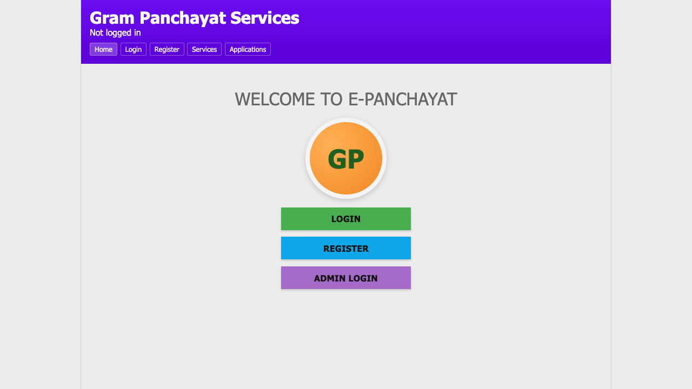
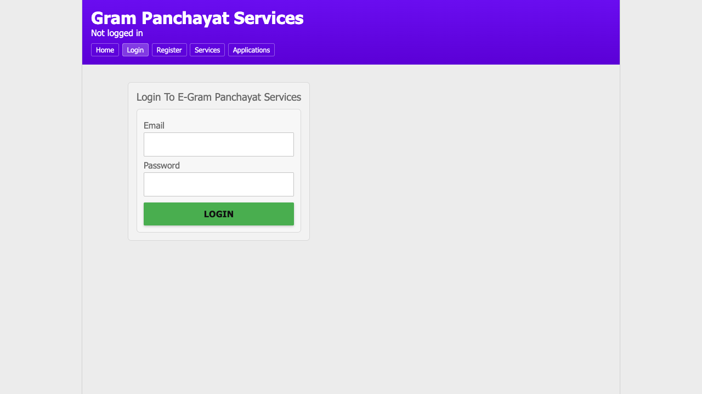
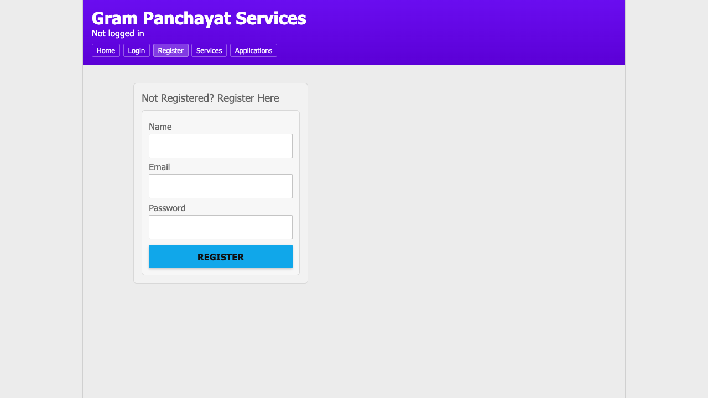
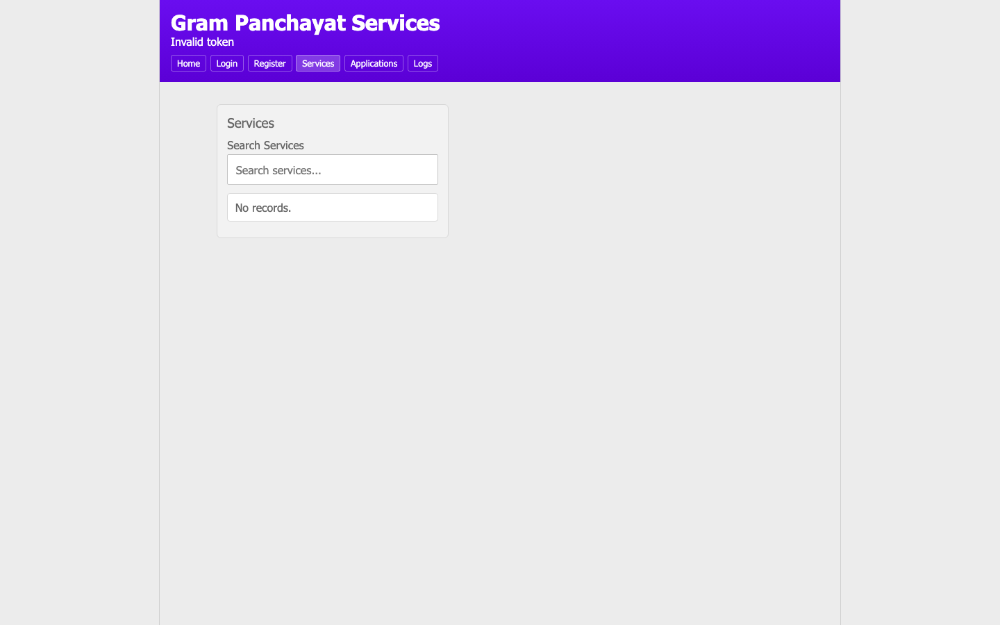
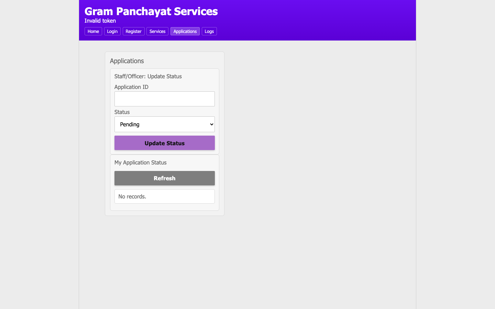

# Digital E Gram Panchayat (React + Node)

Full-stack web app for Gram Panchayat services.

## Repository
- GitHub: `https://github.com/rdebnath1234/Digital-E-Gram-Panchayat`

## Stack
- Frontend: React + Vite + React Router
- Backend: Node.js + Express
- Database: Firebase Firestore
- Auth: JWT (role-based)
- Deployment: Docker + Docker Compose

## Features
- Role flows:
  - `user`: register/login, view/search services, apply, track own application status
  - `staff`: login, update application status, view logs
  - `officer/admin`: login, create/update/delete services, update status, view logs
- Action logging in Firestore `logs` collection
- Seed scripts for fast creation of `staff` / `officer` / `admin`

## Frontend Routes
- `/` Home
- `/login` Login
- `/register` Register
- `/services` Services (auth required)
- `/applications` Applications (auth required)
- `/logs` Logs (`staff|officer|admin` only)

## Project Structure
- `client/` React app
- `server/` Express API
- `docker-compose.yml` multi-container deployment
- `.env.docker.example` Docker env template

## Local Development
### Backend
1. `cd server`
2. Configure `.env`:
   - `PORT=5001`
   - `JWT_SECRET=...`
   - `FIREBASE_PROJECT_ID=your-firebase-project-id`
   - Choose one credential mode:
     - `GOOGLE_APPLICATION_CREDENTIALS=/absolute/path/service-account.json`
     - or `FIREBASE_SERVICE_ACCOUNT_KEY={"type":"service_account",...}`
3. `npm install`
4. `npm run dev`

### Frontend
1. `cd client`
2. Ensure: `VITE_API_BASE_URL=http://localhost:5001/api`
3. `npm install`
4. `npm run dev`

- Frontend (dev): `http://localhost:5173`
- Backend: `http://localhost:5001`

## Seed Users
Run from `server/`.

- Generic:
  - `npm run seed:user -- --name="Staff User" --email="staff@example.com" --password="Pass@123" --role=staff`
- Quick roles:
  - `npm run seed:staff -- --name="Staff User" --email="staff@example.com" --password="Pass@123"`
  - `npm run seed:officer -- --name="Officer User" --email="officer@example.com" --password="Pass@123"`
  - `npm run seed:admin -- --name="Admin User" --email="admin@example.com" --password="Pass@123"`
- Bulk from env:
  - set `SEED_STAFF_*` and `SEED_OFFICER_*` in `server/.env`
  - `npm run seed:roles`

Notes:
- Upsert by email: existing users are updated.
- Allowed roles: `user`, `staff`, `officer`, `admin`.

## Current Seeded Test Logins
- `staff@example.com` / `Pass@123` (role: `staff`)
- `officer@example.com` / `Pass@123` (role: `officer`)

## Docker Deployment
Run from project root.

1. Copy `.env.docker.example` to `.env.docker`.
2. Set in `.env.docker`:
   - `FIREBASE_SERVICE_ACCOUNT_KEY={"type":"service_account",...}`
   - `VITE_API_BASE_URL=http://localhost:5001/api`
3. Ensure `server/.env` has correct `JWT_SECRET` and `FIREBASE_PROJECT_ID`.
4. Start:
   - `docker compose --env-file .env.docker up --build -d`
5. Access:
   - Frontend: `http://localhost:8080`
   - Backend health: `http://localhost:5001/health`

Stop:
- `docker compose down`

Important:
- The Docker setup uses `FIREBASE_SERVICE_ACCOUNT_KEY` so the backend does not depend on a host bind mount for credentials.
- Backend can also read `project_id` from the service-account JSON, but keeping `FIREBASE_PROJECT_ID` in `server/.env` is still recommended.
- Backend container must reach Google APIs (Firestore) over the network.
- If login/seed calls hang in Docker, verify outbound HTTPS from container to `firestore.googleapis.com`.

## Railway Deployment
Deploy the backend from the `server/` directory.

1. Create a Railway service from this repo with root directory set to `server`.
2. Set Railway variables:
   - `PORT=5001`
   - `JWT_SECRET=...`
   - `FIREBASE_PROJECT_ID=your-firebase-project-id`
   - `FIREBASE_SERVICE_ACCOUNT_KEY={"type":"service_account",...}`
3. Deploy.

Notes:
- `FIREBASE_SERVICE_ACCOUNT_KEY` is the safest option on Railway because there is no local credentials file to mount.
- The server now loads `server/.env` consistently and can derive `project_id` from the service-account JSON when needed.

## API
- `POST /api/auth/register`
- `POST /api/auth/login`
- `POST /api/auth/logout`
- `GET /api/users/me`
- `GET /api/services`
- `POST /api/services` (`officer|admin`)
- `PUT /api/services/:id` (`officer|admin`)
- `DELETE /api/services/:id` (`officer|admin`)
- `POST /api/applications` (`user`)
- `GET /api/applications/me`
- `PATCH /api/applications/:id/status` (`staff|officer|admin`)
- `GET /api/logs` (`staff|officer|admin`)

## Smoke Test Checklist
- Health: `GET /health`
- Auth: register + login for user/staff/officer
- Services: create/list/delete
- Applications: apply + status update + verify
- Logs: list as staff/officer

## Testing Screenshots
### Home

### Login

### Register

### Services

### Applications

## Logging Events
- `REGISTER`, `LOGIN`, `LOGOUT`
- `CREATE_SERVICE`, `UPDATE_SERVICE`, `DELETE_SERVICE`
- `APPLY_SERVICE`, `UPDATE_APPLICATION_STATUS`
